
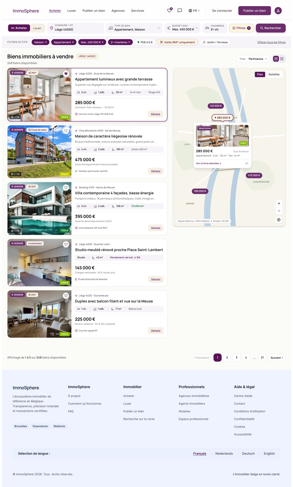

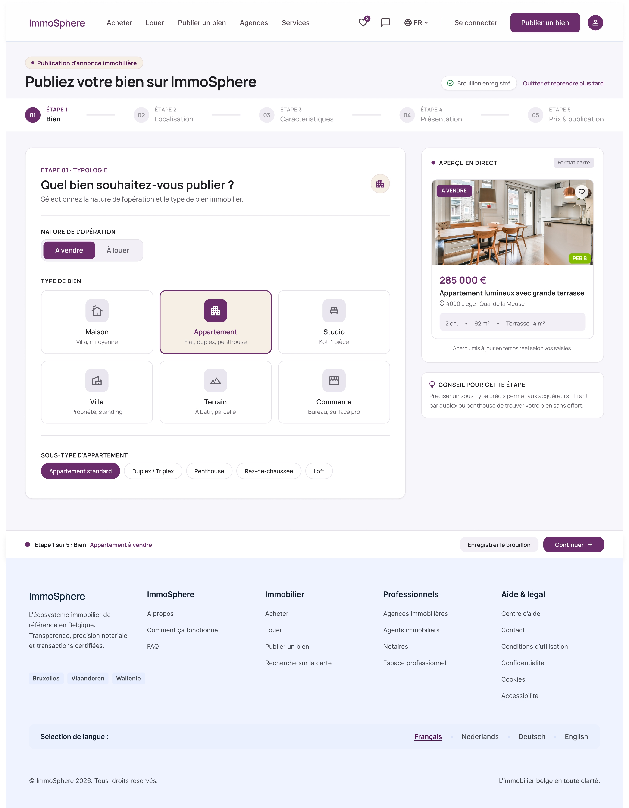
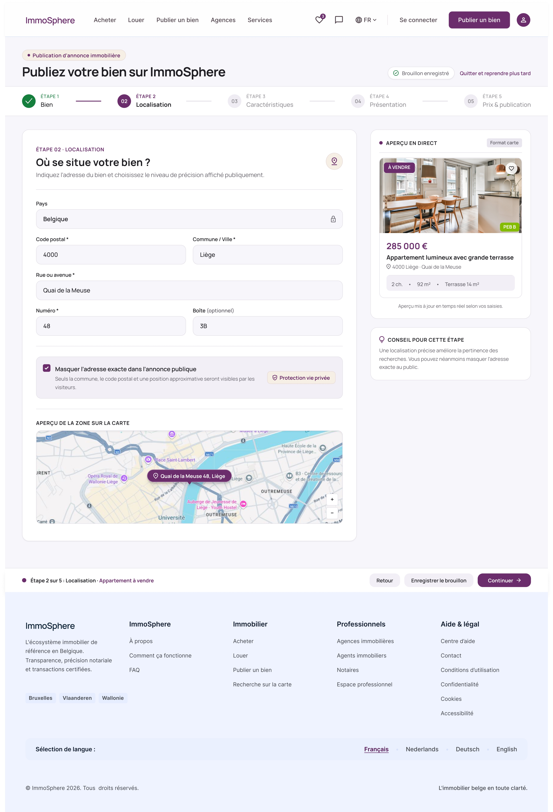

# immoSphere

Plateforme immobilière belge (recherche de biens, publication d'annonces, espaces particuliers et professionnels). Projet d'équipe réalisé pour un client.

> 🚧 **Projet en cours.** La phase d'analyse est terminée et les maquettes sont réalisées. Le développement est à venir, suivi d'un déploiement en production. Ce dépôt sera mis à jour au fil de l'avancement.

## Contexte

immoSphere est le **projet intégré de l'unité « Développement & Architecture Logicielle FullStack »** de la dernière année du bachelier en Développement d'Application (HELMo). C'est le projet le plus conséquent de notre cursus : une application full-stack à réaliser **de A à Z, en équipe**, avec un client, du premier entretien jusqu'à la mise en production.

Nous n'avons pas reçu de cahier des charges : nous l'avons construit à partir du besoin du client.

## Démarche

1. **Interviews du client** : nous menons des entretiens pour comprendre sa problématique, ses contraintes et ses objectifs. Après chaque entretien, nous lui envoyons **un compte rendu par e-mail** pour valider notre compréhension.
2. **Analyse et cahier des charges** : nous traduisons le besoin en périmètre, fonctionnalités et objectifs.
3. **Maquettes** : conception de l'interface avant le développement (voir plus bas).
4. **Évolution du périmètre et gestion du client** : le client apporte des ajouts et des contraintes en cours de route. Nous ajoutons des fonctionnalités et nous l'accompagnons pour garder un projet **réaliste par rapport à son budget**, en arbitrant ce qui est prioritaire.
5. **Développement, tests, puis déploiement en production.**

## Avancement

- [x] Interviews du client et comptes rendus
- [x] Analyse du besoin et cahier des charges *(à confirmer)*
- [x] Maquettes de l'interface
- [ ] Choix de l'architecture et des frameworks
- [ ] Back-end (API)
- [ ] Front-end (SPA Angular)
- [ ] Conteneurisation (Docker) et intégration/déploiement continus (CI/CD)
- [ ] Déploiement en production

## Technologies prévues

| Domaine | Technologie |
|---|---|
| Front-end | Angular (application monopage : composants, routage, gestion d'état, appels d'API asynchrones) |
| Back-end | *à préciser* (par exemple Node.js/Express, NestJS ou Spring) |
| Base de données | *à préciser* |
| Conteneurisation | Docker |
| CI/CD | *à préciser* (par exemple GitLab CI) |
| Versioning et organisation | Git, workflow de branches, board de tâches, méthode Agile |

Les choix définitifs seront justifiés dans la phase de conception (avantages, inconvénients et alternatives écartées).

## Compétences travaillées

Ce projet nous permet de mettre en pratique :

- **Planifier et gérer** un projet d'équipe : commits réguliers, branches, board de tâches, répartition du travail.
- **Concevoir et justifier une architecture** : schéma global, compromis, alternatives, lien avec le cahier des charges.
- **Choisir des frameworks** sur des critères objectifs, en comparant des alternatives.
- **Développer un back-end** : API conforme, authentification, persistance des données, gestion des erreurs, Docker, CI/CD.
- **Développer un front-end** : SPA interactive reliée à l'API, routage, gestion de l'état, cas limites.
- **Justifier son code** : comprendre et expliquer chaque partie du projet.
- **Présenter et défendre le projet** devant un public technique et non technique.
- **Travailler avec un client** : écoute, reformulation, comptes rendus, gestion des attentes et du budget.

## Maquettes

Maquettes de l'interface réalisées lors de la phase de conception. Elles ne représentent pas encore l'application finale.

### Accueil

### Recherche

### Détail d'un bien

### Publier un bien

